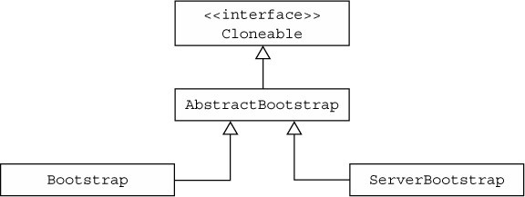
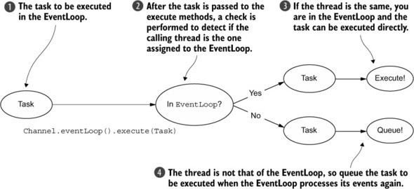
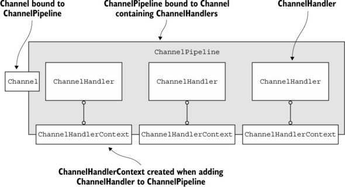
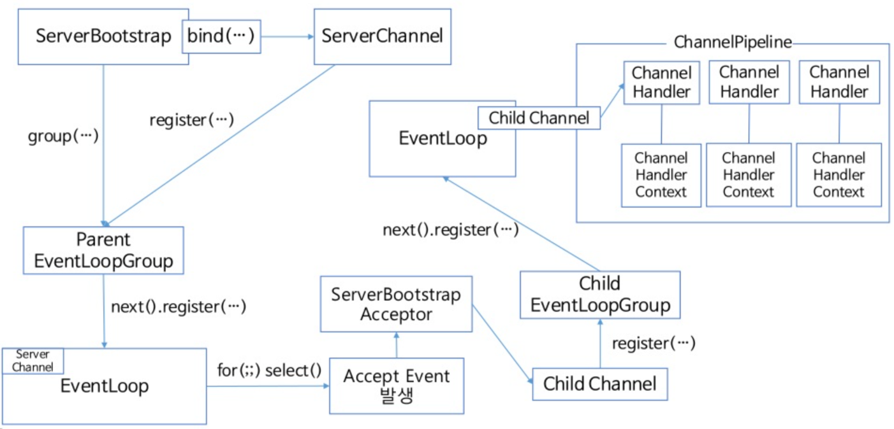

## Netty.io

`Bootstrap`
------------------


`EventLoop`
------------------



`ChannelPipeline`
------------------


`Bootstrap` + `EventLoop` + `ChannelPipeline`
------------------


## 설명
* `telnet` 명령어를 통해 서버에 접속 후 클라이언트 간 통신함.

## 사용법
* 메이븐으로 스프링부트 실행 시 명령어
```
    $ mvn spring-boot:run
```
* CMD 창에서 `telnet` 명령어로 서버 접속 
* 접속 후 `login` 명령어로 `choi` 사용자 로그인
* 패킷 구분은 `|` (파이프)로 구분
```
    $ telnet localhost 8090
    Trying ::1...
    Connected to localhost.
    Escape character is '^]'.
    Your channel key is /0:0:0:0:0:0:0:1:57220
    login|choi
    Successfully logged in as choi.
```
* 다른 CMD 창으로 `telnet` 접속 후 `login` 명령어로 `yu` 사용자 로그인
```
    $ telnet localhost 8090
    Trying ::1...
    Connected to localhost.
    Escape character is '^]'.
    Your channel key is /0:0:0:0:0:0:0:1:57221
    login|yu
    Successfully logged in as yu.
```
* `yu` 사용자가 `choi` 사용자에게 아래와 같이 메시지 전송
```
    choi|hello choi
    The message was sent to [choi] successfully.
```
* `choi` 사용자는 아래와 같이 메시지 확인
```
    [yu] hello choi
```